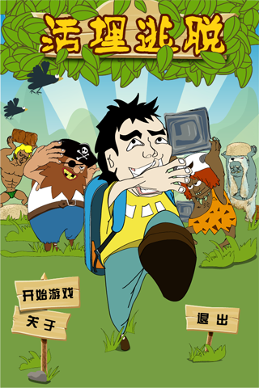
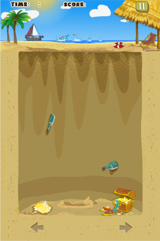
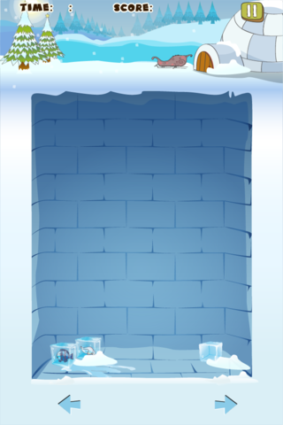
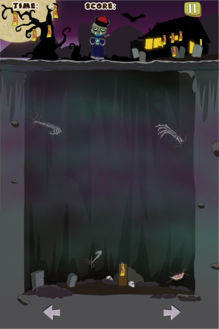
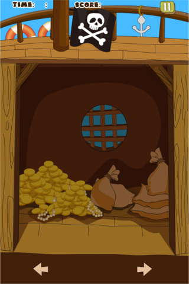

# Buried Alive

This is a Tetris-inspired puzzle game with various beautiful scenes and nerve-wracking background musics, which was developed by SLan Studio using the cross-platform technology of Adobe AIR, then released into several Android Stores of China like [hiapk.com](http://apk.hiapk.com) in 2012. You need to keep climbing, don't stop in order not to be buried alive.

## Instructions
Try to reach to the top and escape getting buried alive. Touch on the right and left side of screen to move and climb up materials.   Avoid being squashed by falling bricks of rock, clay and sand and stacking them into steps that you can use to climb out of the hole. Each type of materials acts differently when it lands.

## Scenes

